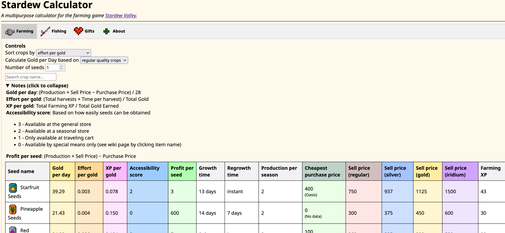
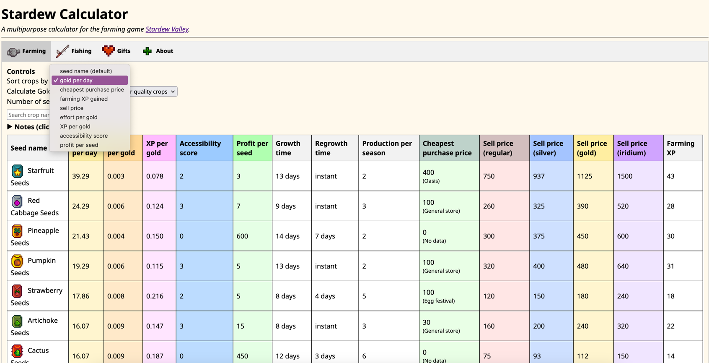
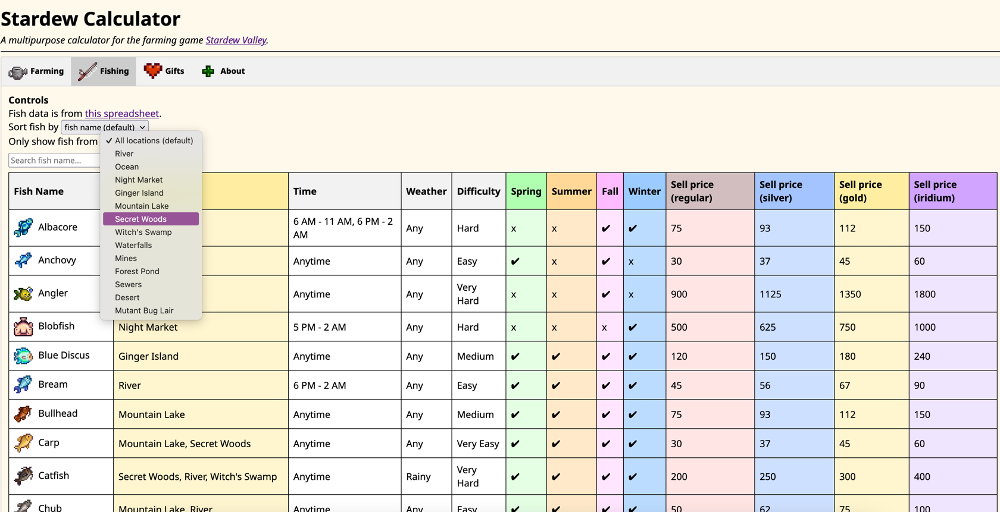
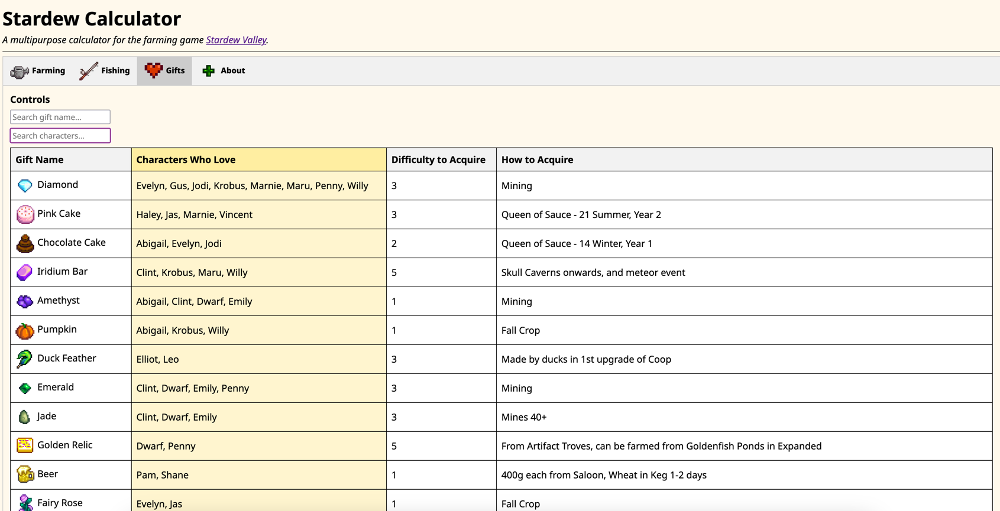
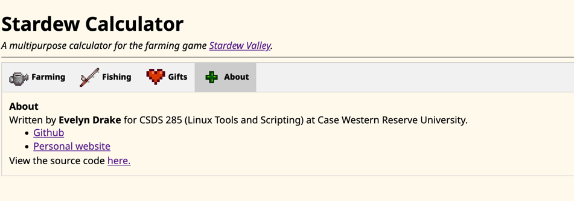

# Stardew Calculator
[Demo on CWRU server](http://eecslab-23.case.edu/~jcd171/cgi-bin/main.php)

### Overview
My CSDS285 final project is a simple web application to help [Stardew Valley](https://www.stardewvalley.net/) players optimize their farming gameplay
using a wide variety of various metrics. Stardew Valley is a popular farming simulation game where 
players grow crops, catch fish, raise animals, develop relationships, and manage many other responsibilities.
While recently playing the game with a friend, I realized how difficult it was to maximize our profits, among other things,
as the available plants have varying growth times, regrowth periods, and selling prices. Thus, I created this tool to help
Stardew Valley players make more informed decisions about their farming strategies based on what they value most.

The backend is written in PHP, and I'm including client-side Javascript to 
enable the user to interact with the table (changing values used in calculation, sorting based on different criteria,
etc.). I am developing this locally on my laptop using PHPStorm, and I created this repository so that I could pull 
my changes down to the EECSlab servers without having to edit it through SSH. I also wrote a very simple Bash script to install the files into the `cgi-bin` folder automatically and fix the image paths.

### Usage
There are four tabs, and the user can navigate between them by clicking on them. Note that the user can view the Stardew Valley wiki page for any item by clicking on its name!

#### Farming
Growing, harvesting, and selling crops makes up Stardew Valley's core gameplay, so I've made this functionality the most complex.

The user can sort the table based on their desired metric using the dropdown, sorting by:
- **Seed name** - Just sorts seeds by their names
- **Gold per day** - Calculates how much gold can be earned from a crop based on its production per season, its sell price, and its purchase price.
- **Cheapest purchase price** - Players may want to buy the cheapest crops possible when money is tight
- **Farming XP gained** - Certain crops are better than others when players want to level up their character
- **Sell price** - If the player already has some crops harvested, they might want to sell the higher-value ones first
- **Effort per gold** - Some crops are more annoying than others to maintain, so this metric indicates how much micromanaging is needed (based on regrowth time and number of harvests required)
- **XP per gold** - Similar to farming XP gained, but some players may want to conserve gold while optimizing their XP gains
- **Accessibility score** - Determines how easy a crop is to acquire based on the locations it can be bought from
- **Profit per seed** - Sometimes, early-game players have limited money, not time, and want to see how much profit a single seed can give over a season

The user can determine if they want to calculate the gold per day based on regular, silver, gold, or iridium quality crops.
They can also scale some of the values by an arbitrary number of seeds, as well as searching for a specific crop's values by name. There is a notes section that can be expanded to reveal the specific calculations used for each metric.

#### Fishing
Players can catch and sell fish in a variety of locations.

The user can sort the table based on their desired metric using the dropdown, sorting by:
- **Fish name** - Just sorts fish by their names
- **Fish difficulty** - Some fish are more difficult to catch than others (based on the in-game fishing minigame data)
- **Sell price** - Some fish sell for more than others

The user can filter fish by their specific locations as well as search for specific fish by name.

#### Gifts
Players can establish relationships with other members of the town by giving them specific gifts.

The user can view a list of available gifts, the characters that appreciate them, their difficulty to acquire, and the means by which they are acquired. The user can search this table by gift name or by character.

#### About
Displays this project's source code as well as my Github and personal website.

### Screenshots (as of 4/19)

### Installation
Initially, you will need to clone this repository into your `public_html` folder:

`git clone https://github.com/evelyndrake/stardew-scraper.git`

Then, you will need to run `./install.sh`, which will install the PHP files in the `cgi-bin` folder and fix the image paths.

You can edit the install script to change the target directory (defaults to `../cgi-bin`) and adjust the image directory (by default it adds my Case ID, but you will need to change this).

The installation script will pull down the latest changes from Github every time you run it, ensuring that your copy is always up to date.