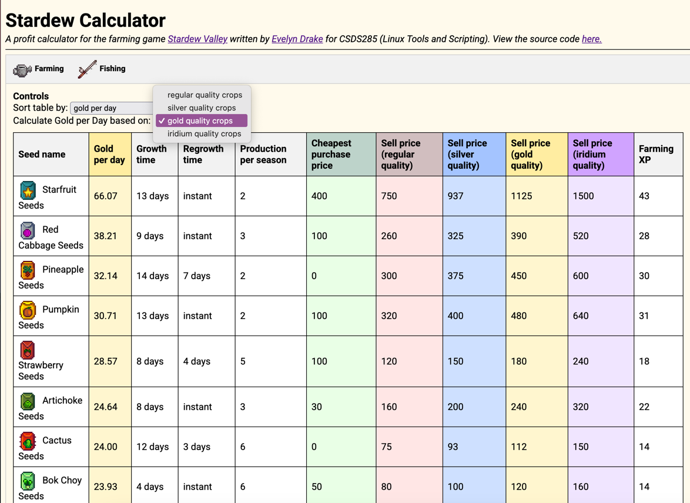

# Stardew Calculator
[Demo on CWRU server](http://eecslab-23.case.edu/~jcd171/cgi-bin/main.php)

### Overview
My CSDS285 final project is a simple web application to help [Stardew Valley](https://www.stardewvalley.net/) players optimize their farming profits 
by calculating the gold earned per day for various crops. Stardew Valley is a popular farming simulation game where 
players grow crops, raise animals, and manage a farm to maximize income. While recently playing the game with a 
friend, I realized how difficult it was to maximize our profits, as the available plants have varying growth times, 
regrowth periods, and selling prices. Thus, I created this tool to help Stardew Valley players make more informed 
decisions about their farming strategies.

The backend is written in PHP, and I'm including client-side Javascript to 
enable the user to interact with the table (changing values used in calculation, sorting based on different criteria,
etc.). I am developing this locally on my laptop using PHPStorm, and I created this repository so that I could pull 
my changes down to the EECSlab servers without having to edit it through SSH. I also wrote a very simple one-line 
shell script to install the files into the cgi-bin folder automatically.

### Goals
In the future, I would like to expand upon the program's functionality by adding in a variety of other gameplay 
mechanics (seasons, artisan goods, etc.) to be taken into account for the calculations. It would be good to create 
new calculations, such as a break-even time for a user-defined initial investment, to make the application more 
useful. The dataset is currently a cleaned-up CSV file that I downloaded online, so I think it would be nice to 
scrape these values off the game's wiki page or extract them from the game files themselves. Using something like 
Chart.js to graph the data in addition to the table would be cool too.

### Screenshots (as of 3/21)

